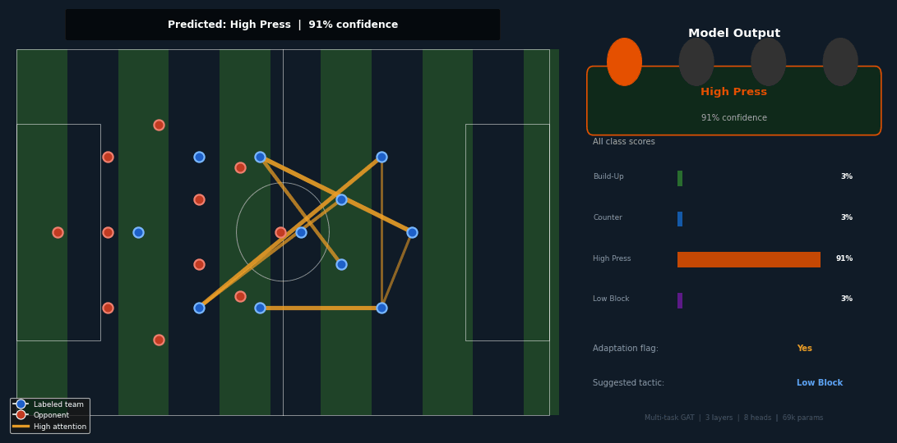
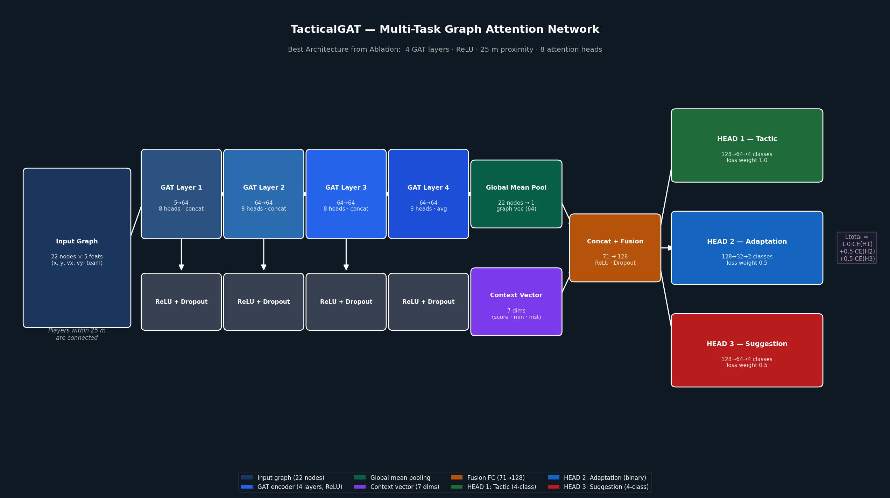

# Tactical Pattern Recognition in Soccer using Graph Neural Networks

**Rishabh Karnawat** | M.Sc. AI, Data Science & Digital Business | Gisma University of Applied Sciences, Berlin

---



---

## What this project does

This thesis builds a system that automatically identifies what tactical pattern a soccer team is executing at any moment during a match — and does two more things simultaneously: detects whether the team is adapting their style to a specific opponent, and suggests which tactic they should switch to given the current score and match phase.

The input is player coordinate data. The output is three predictions every 15 seconds throughout a match, updated automatically without any analyst involvement.

---

## Architecture



The model is a **multi-task Graph Attention Network** with three output heads trained jointly.

```
Player coordinates (x, y, vx, vy, team_flag)
           ↓
    Graph construction
    Players = nodes | Proximity edges (≤15m)
           ↓
    GAT Encoder (3 layers, 8 attention heads each)
    Layer 1: 5 → 64    (concat=True)
    Layer 2: 64 → 64   (concat=True)
    Layer 3: 64 → 64   (concat=False, averages heads)
           ↓
    Global Mean Pooling → (batch, 64)
           ↓
    Context Fusion
    cat(graph_64, context_7) → Linear → ReLU → (batch, 128)
    Context: score, minute, home_flag, 4×tactic history
           ↓
    ┌──────────────┬──────────────┬──────────────┐
    │   HEAD 1     │   HEAD 2     │   HEAD 3     │
    │   Tactic     │  Adaptation  │  Suggestion  │
    │  4-class     │   binary     │   4-class    │
    │  weight 1.0  │  weight 0.5  │  weight 0.5  │
    └──────────────┴──────────────┴──────────────┘
```

**Total parameters: 69,098**

---

## Results

| Head | Task | Accuracy | Macro F1 |
|---|---|---|---|
| HEAD 1 | Tactic classifier (4-class) | 90.6% | 0.447 |
| HEAD 2 | Adaptation flag (binary) | 90.3% | 0.889 |
| HEAD 3 | Suggestion engine (4-class) | 98.9% | 0.986 |

**Comparison with published work (HEAD 1):**

| Work | Task | Data | Best result |
|---|---|---|---|
| Bauer & Anzer (2021) | Binary press detection | Bundesliga (proprietary) | ~68% F1 |
| Anzer et al. (2022) MIT Sloan | Single pattern | Bundesliga (proprietary) | ~72% Acc |
| TacticAI — Wang et al. (2024) | Corner kick receiver | Premier League (proprietary) | ~85% Acc |
| **This thesis** | **4-class open play** | **StatsBomb open data** | **90.6% Acc** |

**Ablation study best configuration:**

| Component | Default | Best found | Evidence |
|---|---|---|---|
| Activation | ELU | **ReLU** | 95.2% vs 86.8% |
| GAT layers | 3 | **4** | 90.2% vs 70.9% |
| Edge proximity | 15m | **25m** | 90.9% vs 88.6% |

---

## Dataset

Three StatsBomb open data competitions:

| Competition | Matches | Events |
|---|---|---|
| La Liga 2015/16 | 380 | ~1.4M |
| FIFA World Cup 2022 | 64 | ~240K |
| Copa America 2024 | 32 | ~120K |
| **Total** | **476** | **~1.6M** |

240,193 clips generated. Split by match (70/15/15) to prevent leakage.
167,815 training | 35,793 validation | 36,585 test.

---

## Project structure

```
tpr_gnn/
│
├── main.py                   ← full pipeline orchestrator
│
├── src/
│   ├── config.py             ← all constants and hyperparameters
│   ├── data_loader.py        ← StatsBomb data download
│   ├── eda.py                ← exploratory data analysis (4 plots)
│   ├── preprocessing.py      ← sliding windows, labeling, position extraction
│   ├── graph_builder.py      ← PyG graph objects, context vectors, DataLoaders
│   ├── model.py              ← TacticalGAT + all baselines + ablation variants
│   ├── train.py              ← training loop, evaluation, checkpointing
│   ├── evaluate.py           ← confusion matrices, attention visualisation
│   └── ablation.py           ← three comparison experiments
│
├── assets/
│   ├── architecture_diagram.png
│   └── demo.gif
│
├── results/                  ← output figures saved here when main.py runs
├── requirements.txt
└── .gitignore
```

---

## Quick start

```bash
# 1. Clone
git clone https://github.com/rishabh-karnawat/tpr-gnn.git
cd tpr-gnn

# 2. Install
pip install -r requirements.txt

# 3. Run full pipeline
python main.py

# 4. Skip EDA (faster)
python main.py --skip-eda

# 5. Skip ablation study (fastest, just trains the main model)
python main.py --skip-eda --skip-ablation
```

**Google Colab:** Open `Rishabh_thesis.ipynb` and run all cells. Requires T4 GPU. Takes approximately 3–4 hours for the full run including all ablation experiments.

---

## The three target columns

| Column | Head | Type | How it is derived |
|---|---|---|---|
| `tactic_label` | HEAD 1 | 4-class | Rule-based from StatsBomb events |
| `adaptation_flag` | HEAD 2 | binary | Deviation from team's historical modal tactic |
| `suggestion_label` | HEAD 3 | 4-class | Lookup table: (score_bracket × minute_bracket) |

**Tactic labeling rules (applied in priority order):**

1. **High Press** — 3+ pressures in opponent half (x > 52.5m) within 15 seconds
2. **Counter-Attack** — ball recovery + 2+ progressive carries (>20m each) within 15 seconds
3. **Low Block** — ≤1 total pressure + ≥70% of passes from own half + ≥3 passes
4. **Build-Up Play** — default (none of the above fired)

---

## Acknowledgements

- StatsBomb for open data: https://github.com/statsbomb/open-data
- PyTorch Geometric: Fey and Lenssen (2019)
- TacticAI inspiration: Wang et al. (2024), Nature Communications

---

## References

- Anzer, G., Bauer, P., Brefeld, U. and Fassmeyer, D. (2022) *Detection of tactical patterns using semi-supervised graph neural networks*. MIT Sloan Sports Analytics Conference.
- Bauer, P. and Anzer, G. (2021) *Data-driven detection of counterpressing in professional football*. Data Mining and Knowledge Discovery, 35(5).
- Decroos, T. et al. (2019) *Actions speak louder than goals*. ACM SIGKDD.
- Kipf, T.N. and Welling, M. (2017) *Semi-supervised classification with graph convolutional networks*. ICLR.
- Velickovic, P. et al. (2018) *Graph attention networks*. ICLR.
- Wang, Z. et al. (2024) *TacticAI: An AI assistant for football tactics*. Nature Communications, 15(1).

---

*Master's thesis project — Gisma University of Applied Sciences, Berlin, 2025*
